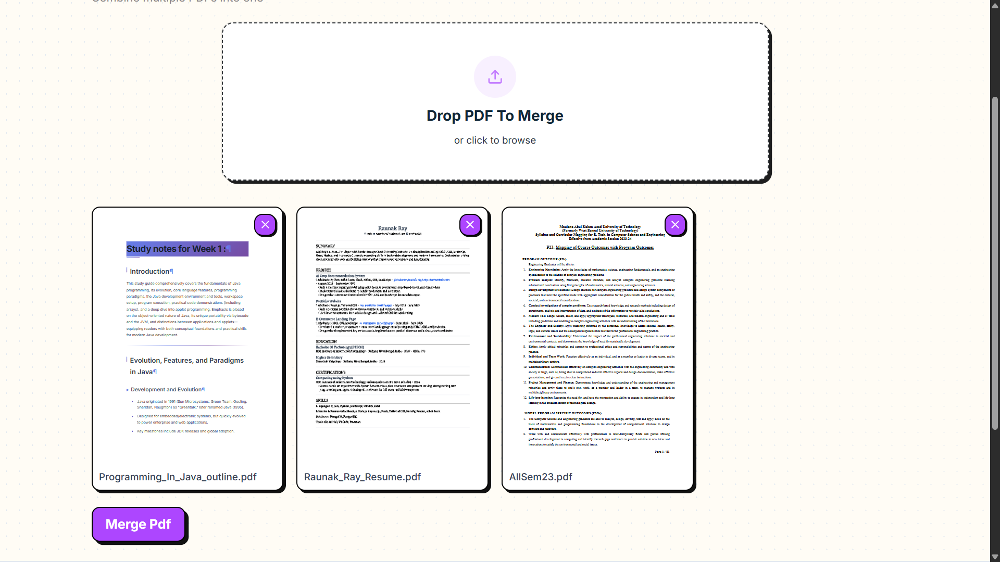
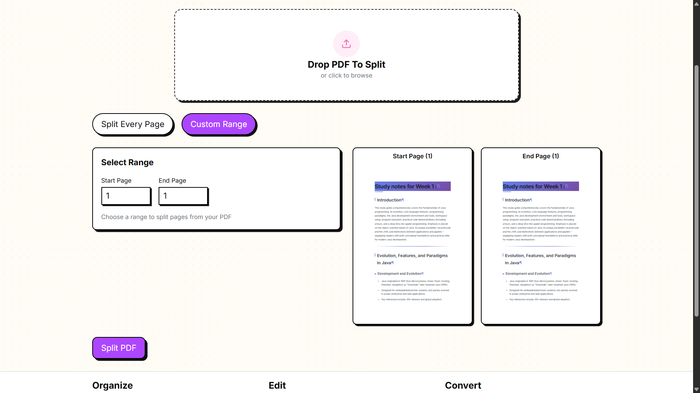
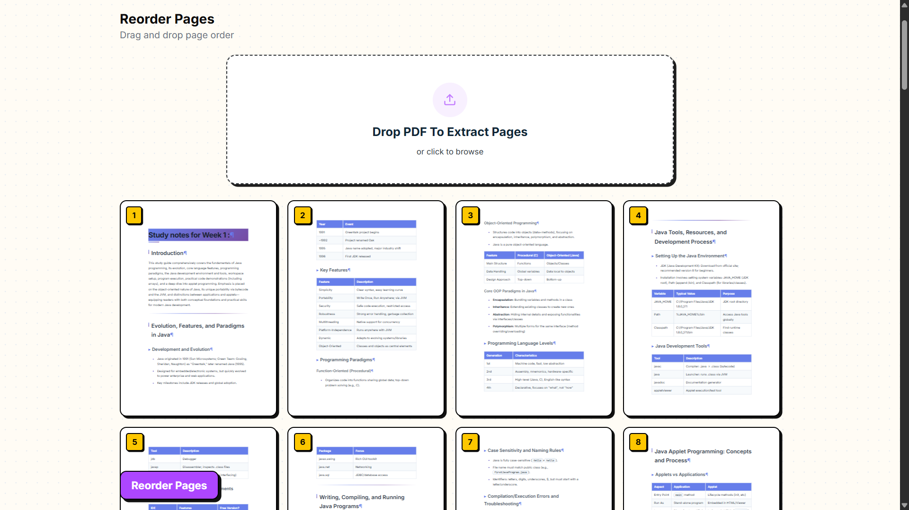
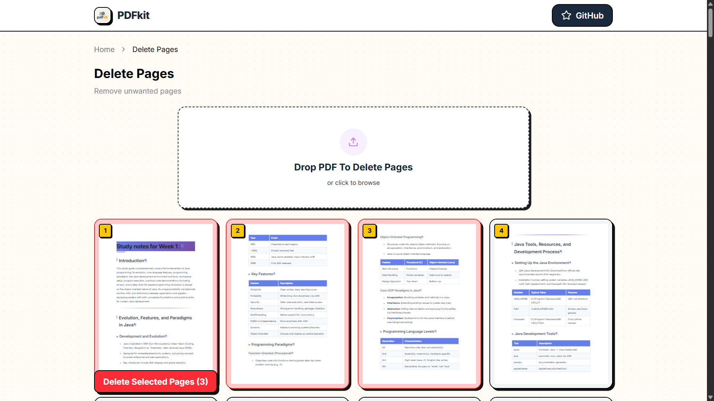
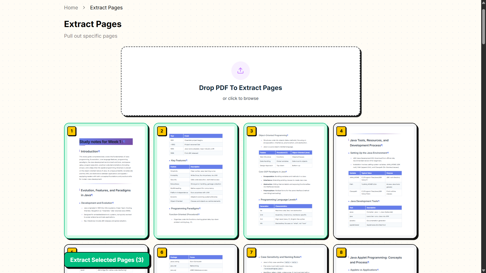
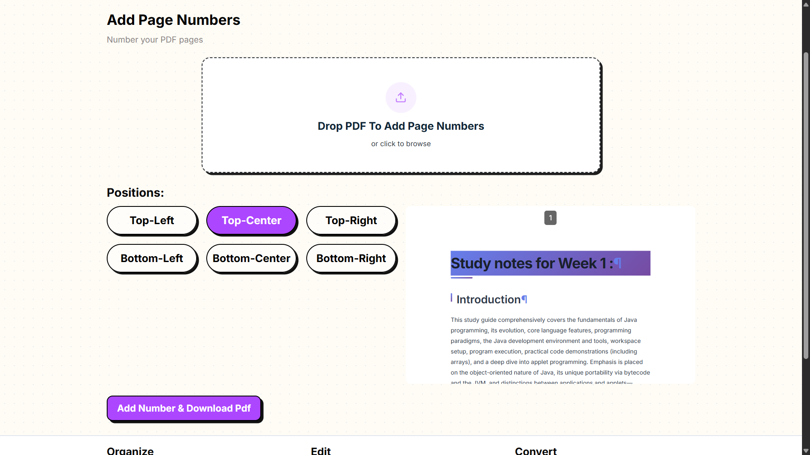
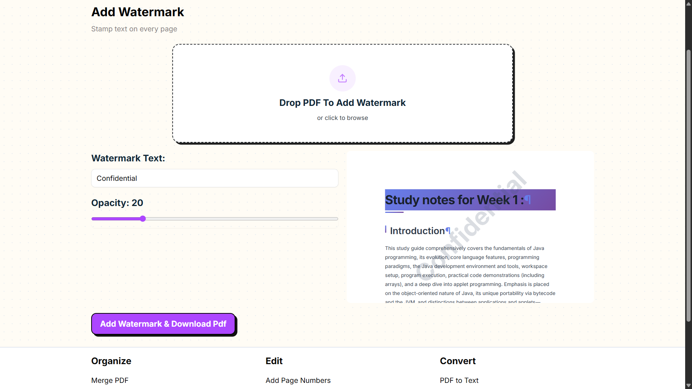
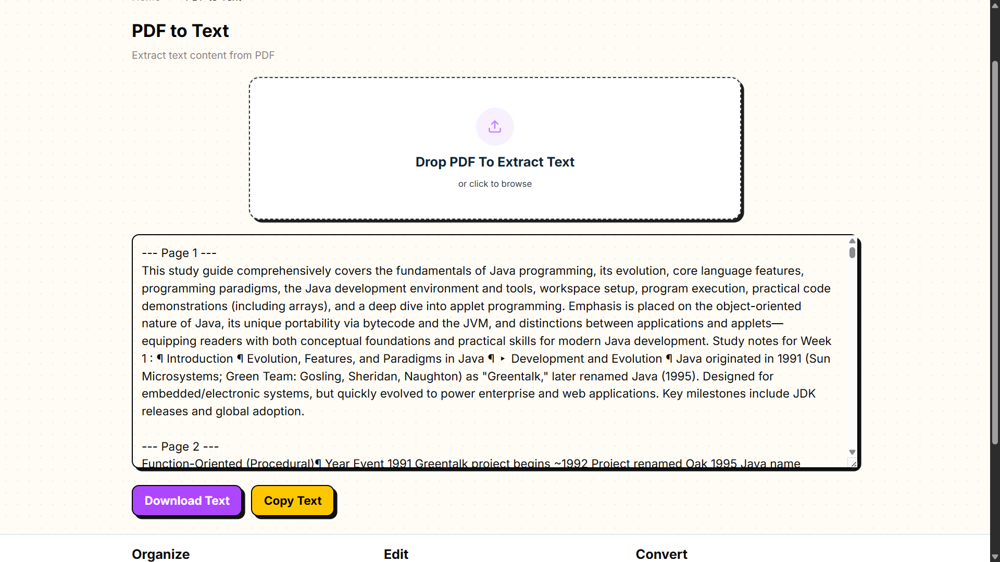
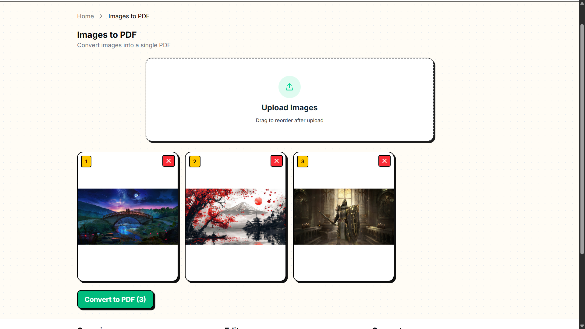

# PDFkit 🧰

A modern, privacy-first PDF toolkit to merge, split, edit, and convert PDFs directly in your browser.

No uploads. No tracking. Completely free.

---

## 🚀 Live Demo

[Live Link](https://pdf-toolbox-six.vercel.app/)

---

## ✨ Features

### 📂 Organize PDFs

**Merge PDFs**

<p align="center">
  
</p>

**Split PDFs**

<p align="center">
  
</p>

**Reorder Pages**

<p align="center">
  
</p>

**Delete Pages**

<p align="center">
  
</p>

**Extract Pages**

<p align="center">
  
</p>

---

### ✏️ Edit PDFs

**Add Page Numbers**

<p align="center">
  
</p>

**Add Watermark**

<p align="center">
  
</p>

---

### 🔄 Convert Files

**PDF → Text**

<p align="center">
  
</p>

**Images → PDF**

<p align="center">
  
</p>

---

## 🔐 Privacy

All processing happens directly in your browser.

* No file uploads
* No server storage
* No data tracking

Your files never leave your device.

---

## ⚡ How It Works

1. Upload your PDF
2. Select a tool
3. Process instantly in browser
4. Download your file

---

## 🛠️ Tech Stack

* Next.js
* React
* Tailwind CSS
* Framer Motion
* Lucide Icons

---

## ⚙️ Getting Started

```bash
git clone https://github.com/raunak-ray/PDFKit.git
cd PDFKit
npm install
npm run dev
```

---

## 📁 Project Structure

```
/app          → Pages & routing  
/components   → UI components  
/lib          → Tools & constants  
/public       → Assets  
```

---

## 🔮 Future Improvements

* PDF → Word conversion
* OCR support
* Batch processing
* Performance optimizations

---

## ⭐ Support

If you find this useful, give it a star ⭐
